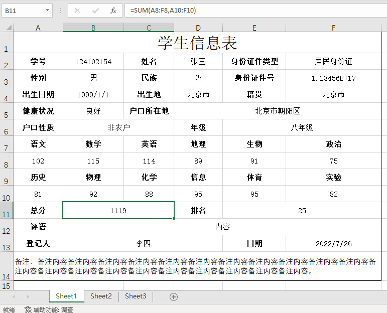

# ReadFormExcel

### 这是什么

本工具用于读取表单形式的Excel文件，并将其转化为Excel统计表形式写入另一个Excel文件中。基于[EasyExcel](https://github.com/alibaba/easyexcel)库封装，自用。

### 这可以做什么

考虑如下形式的Excel表，称这样的表为**表单形式的Excel表**（与之相对的是**统计形式的Excel表**）：



上表中每一个字段的标题所在的单元格并不像统计表那样统一，不统一的地方如下：

* 有些字段的内容在其标题的右侧一个单元格；
* 有些字段的内容在其标题的右侧一个单元格；
* 有些字段的内容在一个合并单元格中；
* `总分`字段的值由公式确定；
* 有些数字字段被解析成数值类型，如`身份证号`字段；

使用本工具处理后的结果如下（称下表为**统计形式的Excel表**：表头均在一行，每行一条数据）：


#### 本工具可以一次性顺利处理的情景如下：

现有若干Excel文件，每个Excel文件中都包含一个结构相同的sheet（如学生信息表），且这个sheet的编号相同（如都在sheet1中）。要求处理所有文件，形成一个输出Excel文件，每个文件表现为输出Excel文件的一行。

#### 本工具不可以一次性顺利处理的情景如下：

1. 现有一个Excel文件，该Excel文件中包含多个结构相同的sheet（如包含多个学生信息表）。要求处理所有sheet，形成一个输出Excel文件，每个文件表现为输出Excel文件的一行。
2. 现有若干Excel文件，每个Excel文件中都包含多个结构相同的sheet（如包含多个学生信息表）。要求处理所有Excel文件，形成一个输出Excel文件，每个文件表现为输出Excel文件的一行。

上两种情况可以通过循环调用`deal()`方法实现，但需要修改`sheetNo`属性。

3. 读取不同结构的sheet，形成多个输出文件。

上述情况目前只能为每种结构类型的sheet创建属于它的配置文件，通过循环调用`deal()`方法实现。

4. 其它未涉及情况。

### 使用方法

#### 1. 导入依赖

```xml
<dependenies></dependenies>
```

#### 2. 定义配置文件

一个示例如下：

```json
{
  "sheetNo": 0,
  "workbookBatchRootPath": "",
  "workbookBatchPathRegex": "",
  "workbookPaths": [
    "C:\\Users\\DELL\\Desktop\\张三.xlsx"
  ],
  "outputPath": "D:\\张三output.xlsx",
  "headLocs": ["A2","C2","E2","E3","A3","C3","E3","A4","C4","E4","A5","C5","A6","D6","A7","B7","C7","D7","E7","F7","A9","B9","C9","D9","E9","F9","A11","D11","A12","A13","E13"],
  "bodyLocs": ["B2","D2","F2","G3","B3","D3","F3","B4","D4","F4","B5","D5","B6","E6","A8","B8","C8","D8","E8","F8","A10","B10","C10","D10","E10","F10","B11","E11","B12","B13","F13"]
}
```

#### 3. 在代码中使用

```java
public class Main {
    // 配置文件的绝对路径
    public static final String CONFIG_PATH = "c:/ConfigurationExample.json";
    
    // 处理时忽略前OFFSET个文件
    public static final int OFFSET = 0;
    
    // 要处理COUNT个文件
    public static final int COUNT = 2000;

    public static void main(String[] args) {
        // 调用包内方法
        ExcelDealer.deal(CONFIG_PATH, COUNT, OFFSET);
    }
}
```

#### 4. 日志记录
创建一个logback.xml文件即可

### 常见问题

#### 问1：我想更改某些字段的显示格式，该怎么办？
答：目前该工具只是**原封不动的**（指全部转换成String类型）将原数据取出，并没有做其它格式化的功能，如需要，需自行实现其逻辑。

#### 问2：我想一次性处理同一个Excel文件中的多个sheet，但我找不到这样的方法？
答：本工具没实现，可自行实现。

#### 问3：配置文件里面的属性都是什么意思啊？
答：详见[Json文件解释]()，若仍有疑问，可提出[issue]()。

#### 问4：数据量大的时候会导致OOM崩溃吗？
答：单个sheet内容太大时，可能会出现，但本人没测试过；本工具处理的逻辑是处理一个文件时，读取文件中所有内容后进行处理，处理完一个Excel文件后关闭文件流；处理多个Excel文件时会不断打开、关闭文件流。

#### 问5：处理速度怎么样？
答：目前本人测试的处理1800张类似上表那样的数据量，需要大约2分钟。

#### 问6：输出形式只能是输出到单个Excel表吗？我需要输出数据库（或直接打印在控制台，或其他途径）？
答：目前只能输出到Excel文件中，可自行修改实现其它输出途径。